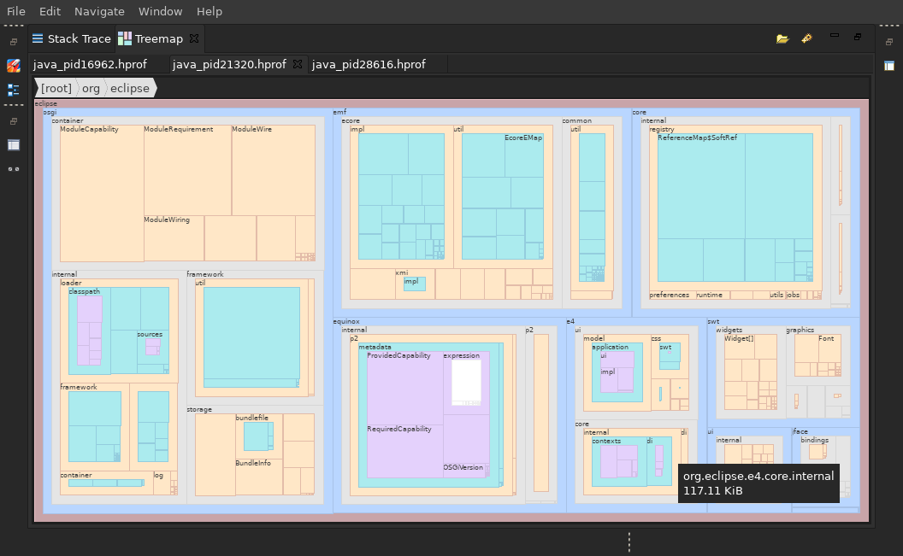

[DEPREACATED] This feature is now integrated into [openjdk/jmc](https://github.com/openjdk/jmc) and enabled by default.

Download a JDK Mission Control 8.0.0 preview release with the treemap view enabled from [AdoptOpenJDK](https://adoptopenjdk.net/jmc.html).

---

# JDK Mission Control Treemap View

This is a Mission Control plug-in to display HEAP usage as a treemap.

---

## Getting Started

The JMC Treemap View is implemented as an Eclipse platform plug-in, thus, you'll need to the lastest Eclipse for Committers and a JDK of your choice.

### Build JMC with Treemap View

1. Import the JMC project into Eclipse. See [this blog post](http://hirt.se/blog/?p=989) for detailed instructions. 
2. Clone this repository. In Eclipse, go to *File -> Import* and use *Existing Projects into Workspace* to import the two containing sub-folders.
3. In Eclipse, go to *Run - Run Configurations* and right click to duplicate *JMC RPC* entry.  In the newly created configuration, enable `org.openjdk.jmc.feature.flightrecorder.ext.treemap` feature in *Plug-ins* tab.
4. Launch JDK Mission Control with this new configuration.

### Use Treemap View

1. After JMC started, go to *Window -> Show View -> Other* and open *Treemap* view.
2. Load an existing heap dump or record a new one:
	- To load a heap dump, click the first icon in the toolbar and select a `.hprof` file. It might take some time to read and analysis the file.
	- To record a heap dump, click the second icon in the toolbar and select a running JVM and destination location. A heap dump will be written and loaded.
3. Use mouse to navigate through the treemap:
	- left double click: zoom-in to the selected tile.
	- right single click: zoom-out to the parent tile.
	- middle single click: rest treemap viewport to root.
	- hovering: display tile name and size in a tooltip.

## TODOs

- [x] improve treemap rendering performance
- [ ] internationalization and localization for UI strings
- [ ] better treemap data binding mechanism
- [ ] custom exception type for treemap view
- [ ] a more suitable icon for recording heap dump
- [x] visualize Old Object Sample events

## License
This project is licensed under the [GNU GENERAL PUBLIC LICENSE (Version 3)](LICENSE).
